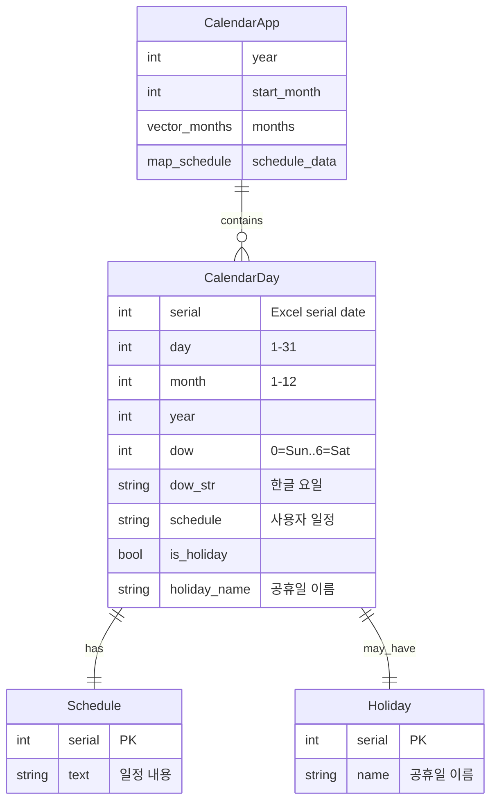
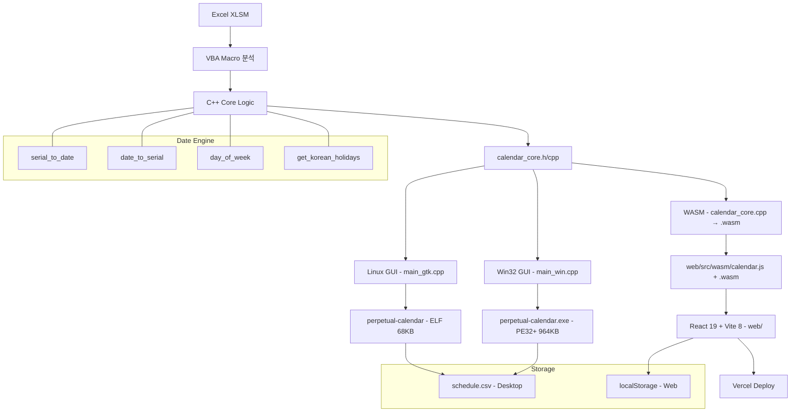

# 만년 달력 (Perpetual Calendar)

> Excel XLSM 파일(엑셀 365일 만년 달력 v1.0.xlsm)의 VBA 매크로를 완전 분석하여  
> **C++**로 처음부터 재구현한 데스크탑 + 웹 크로스플랫폼 달력 프로그램.

[](https://github.com/hslcrb/perpetual-calendar)


---

## 목차 (Table of Contents)

- [기능 (Features)](#기능-features)
- [실행 방법 (Run)](#실행-방법-run)
- [빌드 방법 (Build)](#빌드-방법-build)
- [스크린샷 (Screenshots)](#스크린샷-screenshots)
- [시스템 아키텍처 (System Architecture)](#시스템-아키텍처-system-architecture)
- [C++ → WASM 바인딩](#c--wasm-바인딩)
- [핵심 알고리즘 (Key Algorithms)](#핵심-알고리즘-key-algorithms)
- [데스크탑 vs 웹 비교](#데스크탑-vs-웹-비교)
- [버전 히스토리 (Changelog)](#버전-히스토리-changelog)
- [파일 구조 (File Structure)](#파일-구조-file-structure)
- [라이선스 (License)](#라이선스-license)
- [TODOs](#todos)

---

## 기능 (Features)

| 기능 | Linux | Windows | Web (WASM) |
|------|-------|---------|------------|
| 분기별 6개월 달력 (2×3) | ✅ | ✅ | ✅ |
| 상반기/하반기 네비게이션 | ✅ | ✅ | ✅ |
| 날짜 더블클릭 일정 편집 | ✅ | ✅ | ✅ |
| 대한민국 공휴일 자동 표시 | ✅ | ✅ | ✅ |
| 일정 CSV 저장/불러오기 | ✅ | ✅ | - |
| 일정 localStorage 저장 | - | - | ✅ |
| 요일 컬러 (일=빨강/토=파랑) | ✅ | ✅ | ✅ |
| 공휴일 연분홍 배경 | ✅ | ✅ | ✅ |
| 툴팁 (년월일 요일 정보) | ✅ | ✅ | ✅ |
| 단일 정적 바이너리 | - | ✅ (964KB) | - |
| WASM 웹 배포 | - | - | ✅ |

---

## 실행 방법 (Run)

### 🖥️ Linux 데스크탑 (GTK3)
```bash
./perpetual-calendar
```

### 🪟 Windows
```bash
perpetual-calendar.exe
```

### 🌐 Web 브라우저 (WASM)
```bash
cd web
npm install
npm run dev
# → http://localhost:5173
```

> **배포된 웹앱:** https://perpetual-calendar.vercel.app  
> (GitHub 연결 후 Vercel 프로젝트 import → 자동 CI/CD 배포)

---

## 빌드 방법 (Build)

### 요구사항 (Prerequisites)

**Linux 데스크탑:**
```bash
sudo apt install build-essential cmake libgtk-3-dev
```

**Windows 크로스컴파일 (MinGW64):**
```bash
sudo apt install g++-mingw-w64-x86-64
```

**Web WASM 빌드 (Emscripten):**
```bash
git clone https://github.com/emscripten-core/emsdk.git
cd emsdk
./emsdk install latest
./emsdk activate latest
source ./emsdk_env.sh
```

### 빌드 명령어

```bash
# Linux GTK3 버전
make linux

# Windows MinGW64 버전 (단일 정적 바이너리)
make win

# Web WASM 빌드
cd web && em++ -std=c++11 -O2 -I.. --bind \
  -o src/wasm/calendar.js src/wasm/calendar_bind.cpp \
  ../calendar_core.cpp \
  -s WASM=1 -s MODULARIZE=1 -s EXPORT_NAME=createCalendarModule \
  -s ALLOW_MEMORY_GROWTH=1 -s NO_EXIT_RUNTIME=1 -s ENVIRONMENT=web

# 웹앱 빌드
cd web && npm run build

# 둘 다 빌드
make all

# 정리
make clean
```

---

## 스크린샷 (Screenshots)

```
┌─────────────────────────────────────────────────────────────┐
│  ◀ 이전 분기         2025년 (상반기)         다음 분기 ▶    │
├──────────┬──────────┬──────────┬──────────┬──────────┬───────┤
│ 2025년 1월 │ 2025년 2월 │ 2025년 3월 │ 2025년 4월 │ 2025년 5월│ ...  │
│ 일 월 화.. │ 일 월 화.. │ 일 월 화.. │ 일 월 화.. │ 일 월 화..│      │
│           │           │           │           │           │      │
│  1 신정   │  1        │  1        │  1        │  1        │      │
│  2        │  2        │  2        │  2        │  2        │      │
│  3        │  3        │  3 3·1절   │  3        │  3        │      │
│ ...       │ ...       │ ...       │ ...       │ ...       │      │
│ 28 설날   │           │           │           │ 5 어린이날 │      │
│ 29 설날   │           │           │           │ 6 현충일   │      │
│ 30 설날   │           │           │           │           │      │
└──────────┴──────────┴──────────┴──────────┴──────────┴───────┘
│ 일정은 날짜를 더블클릭하여 추가/수정                          │
└─────────────────────────────────────────────────────────────┘
```

---

## 시스템 아키텍처 (System Architecture)

### Entity Relationship



### 데이터 흐름 (Data Flow)



---

## C++ → WASM 바인딩

C++ 코어 로직(`calendar_core.h/cpp`)은 Emscripten의 **Embind**를 통해 JavaScript에 직접 노출됩니다.

```cpp
// web/src/wasm/calendar_bind.cpp (Embind 바인딩)
EMSCRIPTEN_BINDINGS(calendar_module) {
    function("get_calendar_data", &get_calendar_data_js);
    function("serial_to_date", &serial_to_date_js);
    function("date_to_serial", &date_to_serial_js);
    function("get_korean_holidays", &get_korean_holidays_js);
}
```

```
┌─────────────────────────────────────────────┐
│  calendar_core.cpp/h                        │
│  ┌──────────────────────────────────────┐   │
│  │  serial_to_date(serial) → struct tm  │   │
│  │  date_to_serial(tm) → int            │   │
│  │  day_of_week(y,m,d) → 0..6          │   │
│  │  get_korean_holidays(year) → map     │   │
│  │  CalendarApp::rebuild_calendar()     │   │
│  └──────────────────────────────────────┘   │
│           │  Embind 바인딩                   │
│           ▼                                  │
│  calendar_bind.cpp                          │
│  ┌──────────────────────────────────────┐   │
│  │  get_calendar_data_js() → val(JSON)  │   │
│  │  serial_to_date_js() → val(JSON)     │   │
│  │  ...                                 │   │
│  └──────────────────────────────────────┘   │
│           │  emcc --bind                     │
│           ▼                                  │
│  calendar.wasm + calendar.js                │
└─────────────────────────────────────────────┘
           │  import createCalendarModule
           ▼
┌─────────────────────────────────────────────┐
│  React App (useCalendar hook)               │
│  ┌──────────────────────────────────────┐   │
│  │  const mod = await createModule()    │   │
│  │  mod.get_calendar_data(2025, 1)      │   │
│  │  mod.serial_to_date(45658)           │   │
│  │  const { months } = mod              │   │
│  └──────────────────────────────────────┘   │
└─────────────────────────────────────────────┘
```

---

## 핵심 알고리즘 (Key Algorithms)

### Excel Serial → Date 변환

Excel은 날짜를 **serial number**로 저장합니다 (1900-01-01 = 1).  
이 프로젝트는 다음 알고리즘으로 변환합니다:

```
serial_to_date(serial):
  epoch = 1899-12-30 00:00 (serial 0)
  target = epoch + (serial - 1) * 86400 seconds
  return localtime(target)
  
date_to_serial(date):
  epoch = 1899-12-30
  serial = (date - epoch) / 86400
  if date > 1900-02-28:
    serial += 1  // Lotus 123 leap year bug 보정
  return serial
```

### 요일 계산 (Zeller's Congruence)

```cpp
static int day_of_week(int year, int month, int day) {
    if (month < 3) { month += 12; year--; }
    int q = day, m = month;
    int k = year % 100, j = year / 100;
    int h = (q + (13*(m+1))/5 + k + k/4 + j/4 + 5*j) % 7;
    return (h + 6) % 7;  // 0=Sun .. 6=Sat
}
```

### 대한민국 공휴일

| 구분 | 공휴일 | 날짜 |
|------|--------|------|
| **고정** | 신정 | 1월 1일 |
| | 3·1절 | 3월 1일 |
| | 어린이날 | 5월 5일 |
| | 현충일 | 6월 6일 |
| | 광복절 | 8월 15일 |
| | 개천절 | 10월 3일 |
| | 한글날 | 10월 9일 |
| | 성탄절 | 12월 25일 |
| **음력** (연도별 근사) | 설날 | 1-2월 (연동) |
| | 석가탄신일 | 4-5월 (연동) |
| | 추석 | 9-10월 (연동) |

---

## 데스크탑 vs 웹 비교

| 항목 | Linux Desktop (GTK3) | Windows (Win32) | Web (WASM + React) |
|------|--------------------|-----------------|-------------------|
| **GUI 프레임워크** | GTK+ 3.0 | Win32 API | React 19 |
| **빌드 도구** | g++ + pkg-config | MinGW64 (cross) | Vite 8 |
| **바이너리 크기** | 68KB (동적 링크) | 964KB (정적 링크) | ~220KB JS + ~39KB WASM |
| **의존성** | libgtk-3.so | 없음 (단일 exe) | 브라우저 |
| **일정 저장** | schedule.csv | schedule.csv | localStorage |
| **개발 언어** | C++11 | C++11 | C++11 (WASM) + TS |
| **코어 엔진** | `calendar_core.cpp` | `calendar_core.cpp` | WASM 컴파일됨 |

---

## 버전 히스토리 (Changelog)

```
v1.0.0 (2025-07-03)
├── feat: Linux GTK3 네이티브 GUI
├── feat: Windows Win32 단일 정적 바이너리 (MinGW64 cross-compile)
├── feat: WASM 웹앱 (Emscripten + React + Vite)
├── feat: Excel serial 변환, 요일 계산, 한국 공휴일 엔진
├── feat: 분기별 6개월 달력, 일정 편집, CSV/localStorage 저장
├── build: Makefile (Linux + MinGW), vercel.json
└── docs: README (Mermaid ERD), todos.md, CHANGELOG

v1.0.0-beta (2025-07-02)
└── init: XLSM 분석 → C++ 프로젝트 시작
```

---

## 파일 구조 (File Structure)

```
perpetual-calendar/               # 루트 (데스크탑 바이너리 + 전체 소스)
├── calendar_core.h               # 달력/일정/공휴일 핵심 로직 헤더
├── calendar_core.cpp             # Excel serial 변환, 요일 계산, 공휴일 데이터
├── main_gtk.cpp                  # Linux GTK3 GUI (native)
├── main_win.cpp                  # Windows Win32 GUI (MinGW cross-compile)
├── Makefile                      # Linux + MinGW 통합 빌드 시스템
├── perpetual-calendar            # Linux 실행 파일 (68KB)
├── perpetual-calendar.exe        # Windows 실행 파일 (964KB, static link)
├── schedule.csv                  # 일정 데이터 파일 (자동 생성)
├── .gitignore
├── README.md                     # 프로젝트 문서
├── todos.md                      # 개발 로드맵
│
└── web/                          # WASM 웹 프로젝트
    ├── index.html                # HTML 엔트리
    ├── vite.config.ts            # Vite 설정
    ├── vercel.json               # Vercel 배포 설정 (SPA rewrite)
    ├── tsconfig.json             # TypeScript 설정
    ├── package.json              # 의존성
    ├── .gitignore
    │
    ├── src/
    │   ├── main.tsx              # React DOM 마운트
    │   ├── App.tsx               # 메인 앱 컴포넌트
    │   ├── Calendar.css          # 전체 스타일시트
    │   ├── vite-env.d.ts         # Vite 타입 선언
    │   │
    │   ├── wasm/
    │   │   ├── calendar_bind.cpp  # Embind C++→JS 바인딩
    │   │   ├── calendar.js        # Emscripten JS glue (자동생성)
    │   │   ├── calendar.wasm      # WebAssembly 바이너리 (자동생성)
    │   │   └── calendar.d.ts      # TypeScript 타입 정의
    │   │
    │   ├── components/
    │   │   ├── MonthView.tsx      # 월별 달력 그리드
    │   │   └── EditDialog.tsx     # 일정 편집 다이얼로그
    │   │
    │   └── hooks/
    │       └── useCalendar.ts    # WASM 바인딩 + 상태 관리 훅
    │
    └── dist/                     # 빌드 결과물 (gitignore)
```

---

## TODOs

전체 로드맵은 [`todos.md`](./todos.md) 참조.

### 단기
- [ ] 음력 기반 명절 정확한 날짜 라이브러리 연동
- [ ] 일정 알림 (Notification API)
- [ ] 달력 PDF/이미지 출력
- [ ] 반복 일정 (매주/매월)

### 중기
- [ ] SQLite 저장 (CSV → DB)
- [ ] macOS Cocoa/AppKit 포팅
- [ ] CI/CD (GitHub Actions → Vercel + Release)

### 장기 — 궁극의 도구
> 젠스파크 + 오픈코드 + 클로드코드 + 파이코딩에이전트 + 안티그래비티 IDE/CLI +  
> 노션 + 옵시디언 + MCP + 리버싱 프레임워크 통합 궁극의 도구

---

## 라이선스 (License)

MIT
