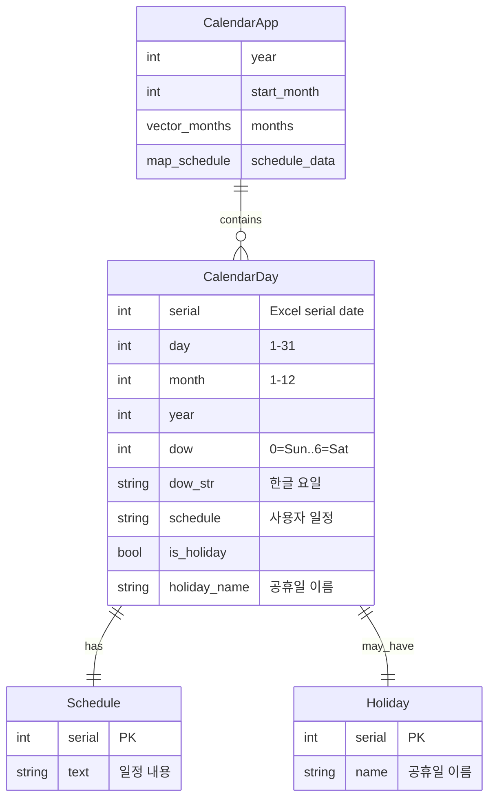
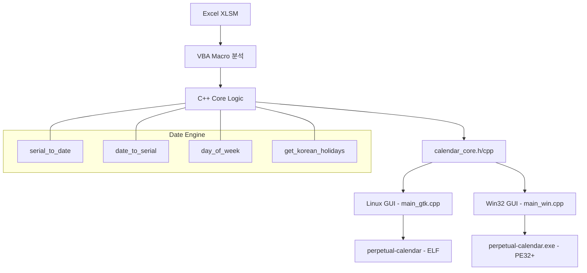

# 만년 달력 (Perpetual Calendar)

365일 만년 달력 데스크탑 GUI 프로그램. Excel XLSM 파일을 분석하여 C++로 구현.

## 기능 (Features)

- **분기별 6개월 달력** — 1-6월(상반기) / 7-12월(하반기) 표시
- **분기 이동** — 이전/다음 분기 버튼 네비게이션
- **일정 관리** — 날짜 더블클릭으로 일정 추가/수정
- **공휴일 자동 표시** — 대한민국 법정 공휴일 및 명절
- **일정 저장/불러오기** — CSV 파일 자동 저장
- **크로스 플랫폼** — Linux (GTK3) + Windows (Win32, 단일 바이너리)

## 시스템 아키텍처 (System Architecture)





## 빌드 방법 (Build)

### 요구사항 (Prerequisites)

**Linux:**
```bash
sudo apt install build-essential cmake libgtk-3-dev
```

**Windows 크로스컴파일 (MinGW64):**
```bash
sudo apt install g++-mingw-w64-x86-64
```

### 빌드 (Build Commands)

```bash
# Linux GTK3 버전
make linux

# Windows MinGW64 버전 (단일 정적 바이너리)
make win

# 둘 다 빌드
make all

# 정리
make clean
```

## 파일 구조 (File Structure)

```
perpetual-calendar/
├── calendar_core.h        # 달력/일정/공휴일 핵심 로직 헤더
├── calendar_core.cpp      # Excel serial 변환, 요일 계산, 공휴일 데이터
├── main_gtk.cpp           # Linux GTK3 GUI (native)
├── main_win.cpp           # Windows Win32 GUI (MinGW cross-compile)
├── Makefile               # Linux + MinGW 통합 빌드 시스템
├── perpetual-calendar     # Linux 실행 파일 (68KB)
├── perpetual-calendar.exe # Windows 실행 파일 (964KB, 정적 링크)
├── schedule.csv           # 일정 데이터 파일 (자동 생성)
├── README.md              # 프로젝트 문서
└── todos.md               # 개발 로드맵
```

## 라이선스 (License)

MIT
